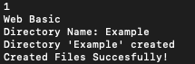

  <h1 align='center'>Outset</h1>

  <p align="center">
    
  </p>

  <p align="center">
    
    
    
    
  </p>

  <p align="center"><a href="https://www.buymeacoffee.com/jcv12"> </a></p><br><br>
    
  ## Description
  This is a quick Python script that creates a directory and files for my personal use. This repository can be used by anyone and I have plans to update this regulary but for now this will be my personal script.


  ## Table of Contents
  - [Description](#description)
  - [Installation](#installation)
  - [Usage](#usage)
  - [License](#license)
  - [Contributing](#contributing)
  - [Tests](#tests)
  - [Questions](#questions)

  ## Usage
  ``` Clone from the github ```
  
  ``` Python3 start.py ```

  ## License
  
  <br />
  This application is covered by the Academic license.

  ## Contributing
  JCV

  ## Questions
  Contact me by Github<br />
  <br />
  :octocat: Find me on GitHub: [jcv12](https://github.com/jcv12)<br />
  <br />
  :e-mail: Email me with any questions: john.c.vayianos@gmail.com<br /><br />

  _This README was made by [README-generator](https://github.com/jcv12/ReadMe-Generator)_
  
